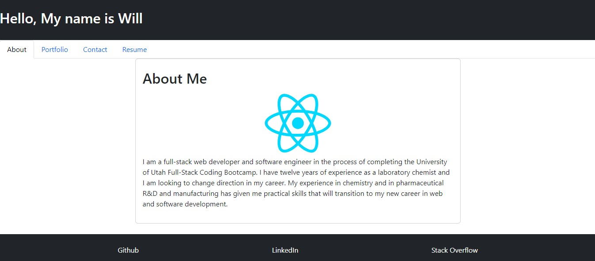
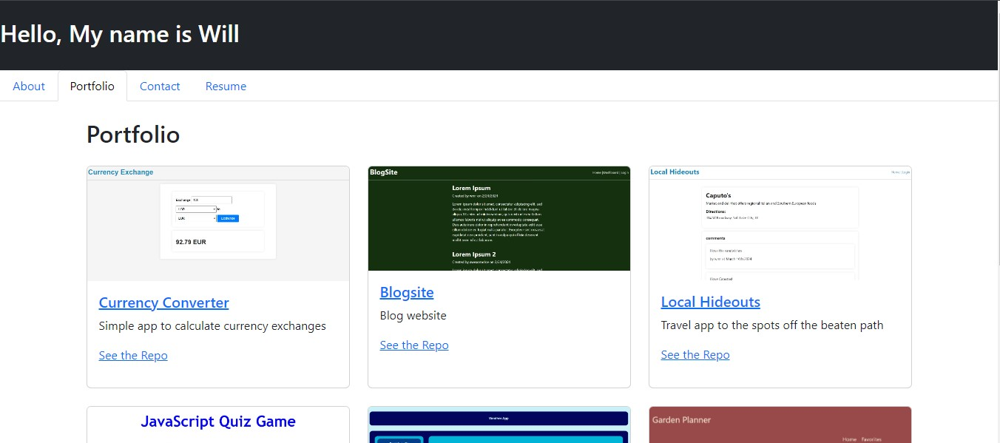

# React Portfolio

## Description
As a full-stack developer seeking employment I want to display a single-page portfolio so that amd employer looking for candidates with experience building single-page applications can assess whether I am a good candidate for an open position

This project gives me the opportunity to utilize React to create a single page web application.

## Table of Contents

If your README is long, add a table of contents to make it easy for users to find what they need.

- [Installation](#installation)
- [Usage](#usage)
- [Credits](#credits)
- [License](#license)

## Installation
No installation necessary

## Usage

Click [here](https://willrankin.netlify.app/) to visit the portfolio webpage

The page will display the "About Me" section automatically

Click on the navigation links to visit the portfolio, contact, and resume sections.

In the portfolio section, click on the project name to view the deployed project or click "See the Repo" to view the associated repository.

Contact information can be found in the 'Contact' page

Resume and relevant skills can be found in the 'Resume' section

## Credits
React

The following tutorial was used for some sections of the web page
https://www.freecodecamp.org/news/build-portfolio-website-react/

## License

MIT License
---